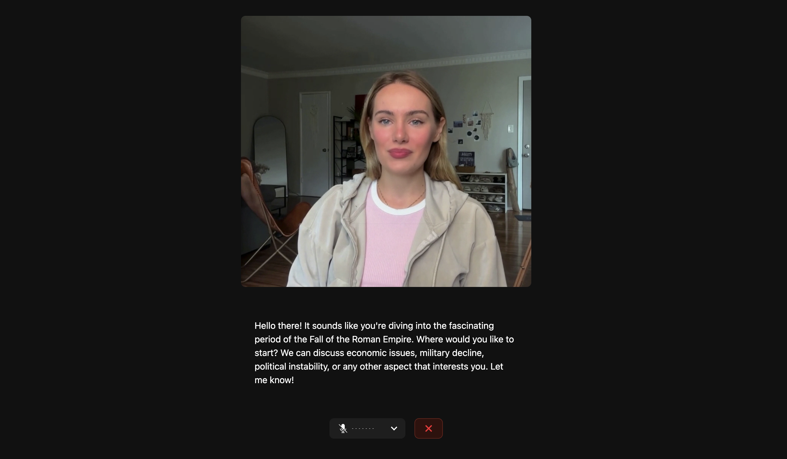

# Personal Shopping Assistant with Tavus Avatar

This is a voice-enabled personal shopping assistant built with [LiveKit Agents](https://docs.livekit.io/agents) and [Tavus Avatars](https://tavus.io/). It creates an interactive shopping experience with Sarah, your AI shopping companion, featuring product recommendations, swipeable product discovery quizzes, and discount rewards.

## Features

- **Voice Shopping**: Natural conversation with Sarah to find the perfect products for your needs
- **Product Cards**: Visual product displays with detailed information, ratings, and pricing
- **Swipeable Product Discovery**: Tinder-like interface to discover products you'll love
- **Discount Rewards**: Earn 5% discount by liking 3+ products in discovery quizzes
- **Smart Search**: AI-powered product search across 11,000+ items using fuzzy matching
- **Real-time Recommendations**: Get personalized product suggestions based on your preferences



## Getting started

Run the following commands to set up the frontend:

```bash
cd voice-assistant-frontend
npm install
npm run dev
```

And open http://localhost:3000 in your browser.

You'll need to run the Tavus agent in a separate terminal:

```bash
cd ..
python tavus.py
```

> [!NOTE]
> Make sure you've configured your environment variables in the `.env` file as described in the main README.

## How to Use

1. **Start Shopping**: Click "Start Shopping with Sarah" to begin your personalized shopping experience
2. **Voice Commands**: Ask Sarah to:
   - "Show me the best discounts available"
   - "Find beauty products under $20"
   - "Create a product quiz for electronics"
   - "Search for wireless headphones"
3. **Product Cards**: View detailed product information, prices, ratings, and stock levels
4. **Product Discovery Quiz**: Swipe through products like Tinder - like products you're interested in
5. **Earn Discounts**: Like 3 or more products in a quiz to unlock a 5% discount

## Components

### ProductCard
- Displays product information with images, prices, ratings
- Flip animation to show detailed specifications
- Direct action buttons for viewing details or adding to cart

### ProductSelectionQuiz
- Tinder-like swipe interface for product discovery
- Drag to like/dislike or use action buttons
- Real-time feedback with visual indicators

### ProductQuizContainer
- Manages quiz state and discount rewards
- Shows congratulations for earning discounts
- Displays liked products summary

## Shopping Features

- **11,000+ Products**: Comprehensive database across multiple categories
- **Smart Categories**: Beauty, Electronics, Clothing, Home & Garden, Groceries, and more
- **Fuzzy Search**: Find products even with partial or misspelled queries
- **Price Filtering**: Search within specific budget ranges
- **Discount Highlighting**: Special emphasis on deals and savings
- **User Preference Learning**: Builds profile based on liked products

## Contributing

This project is open source and we welcome contributions! Please open a PR or issue through GitHub, and don't forget to join us in the [LiveKit Community Slack](https://livekit.io/join-slack)!
